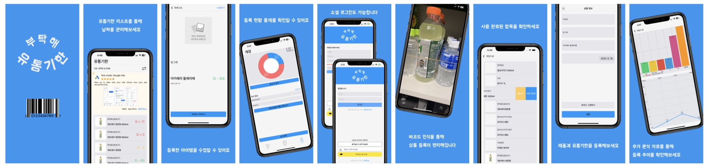
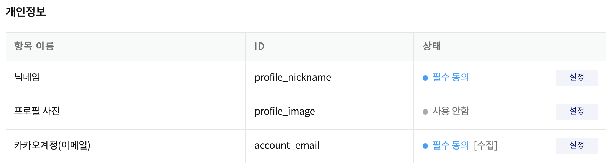

# RemExp



#### 바코드 인식을 활용해 쉽게 식료품 유통기한을 등록하고 확인할 수 있는 앱입니다.

# Link

[부탁해 유통기한 앱스토어 링크](https://apps.apple.com/app/부탁해-유통기한/id6450455777)

# 개발 기간 및 인원
- 2023.05.08 ~ 2023.06.21
- 배포 이후 지속적 업데이트 중 (현재 version 1.3.1)
- 최소 버전: iOS 15.0
- 2인 개발
  - 담당 업무: iOS 개발, 앱 테마 컬러 및 디자인 개괄
  - 공통 업무: 기획 및 DB Table 설계 

# 사용 기술
- **UIKit, AVFoundation, AuthenticationServices, CryptoKit, SafariServices, AdSupport, AppTrackingTransparency, SPM**
- **FirebaseAuth, FirebaseFireStore, FirebaseStorage, GoogleSignIn, KakaoSDKAuth, KakaoSDKUser, GoogleMobileAds, Charts**
- **MVC, Singleton, GCD**
- **NSAnchor Extension, leading & trailingSwipeActionConfiguration, custom Delegate, AVCaptureVideoPreviewLayer & AVCaptureMetadataObject**

------

# 기능 구현
- `AVCaptureVideoPreviewLayer`를 활용하여 실시간 카메라 화면을 구현, `AVCaptureMetadataObject`로  바코드를 인식하는 기능 구현
  - `AVCaptureSession`에서 barcodeReader 설정
  - `AVCaptureMetadataOutputObjectsDelegate`의 `metadataOutput` 메서드에서 해당 metadata 인식 가능하면 FireStore query로 상품 등록 여부 확인
- `FireStore` 활용, 상품 정보 DB Table 설계, CRUD 구성 및 각 유저가 등록한 제품의 유통기한 정보 관리
- `FirebaseAuth`를 비롯, `GoogleSignIn`, `KakaoSDKAuth`, `AuthenticationServices`를 활용해 구글, 카카오, Sign In Apple 소셜 로그인 구현 
- tableView의 `swipeActionConfiguration`을 구현하여 등록 아이템 삭제, 사용 완료 처리 및 쿠팡 재주문 등의 기능 함축
- custom `Delegate`를 활용하여 바코드 인식 후의 상품 데이터 전달, 유저 로그아웃 및 탈퇴 시 화면전환 구현
- `AppTrackingTrasnparency` 및 `AdSupport` 통한 유저 데이터 추적 권한 요청 및 `Admob` 활용 네이티브 광고 게재

------

# Trouble Shooting

### A. 소셜 로그인 구현

#### 1. Firebase에서 제공하지 않는 카카오 계정 관리 기능

Firebase에서 Apple과 Google 계정은 각각 Sign In Apple과 Sign in with Google 기능만 구현해서 유저 확인을 해주면 등록 및 관리 작업은 알아서 해준다.
하지만 카카오 계정은 해당 기능을 제공하지 않아서 단계별로 접근해서 카카오 유저 이메일을 직접 Firebase에 등록하는 작업까지 구현을 해야 했다.

```swift
func kakaoLogin() {
    // 카카오톡 실행 가능 여부 확인
    if UserApi.isKakaoTalkLoginAvailable() {
        //카카오톡으로 로그인하기
        kakaoLoginInApp()
    } else {
        //웹으로 카카오 로그인하기
        kakaoLoginInWeb()
    }
}

private func kakaoLoginInApp() {
    UserApi.shared.loginWithKakaoTalk() { (oauthToken, error) in
        if let error = error {
            print("카카오톡 로그인 에러: \(error.localizedDescription)")
        } else {
            print("카카오톡 로그인 성공")
            guard let token = oauthToken else { return }    
            self.signUpFirebase(token)
        }
    }
}

private func kakaoLoginInWeb() {
    UserApi.shared.loginWithKakaoAccount(prompts: [.Login]) { oauthToken, error in
        if let error = error {
            print("카카오 계정 로그인 에러: \(error.localizedDescription)")
        } else {
            print("카카오 계정 로그인 성공")    
            guard let token = oauthToken else { return }    
            self.signUpFirebase(token)
        }
    }
}
```

카카오를 통해 계정 확인이 되었다면 내부적으로 직접 FirebaseAuth에 해당 이메일과 비밀번호를 등록해서 자동 로그인이 되도록 구성하기 위해 카카오에게서 유저 이메일을 받아왔어야 했다.



카카오에게서 받고나면 token에서 이메일을 추출해 FirebaseAuth에 등록한다.

```swift
func signUpFirebase(_ token: OAuthToken) {
    //파이어베이스 인증 서버에 회원가입 및 로그인을 완료합니다.
    //로그인 여부를 확인합니다.
        
    UserApi.shared.me { user, error in
        if let error = error {
            print("사용자 정보 가져오기 에러: \(error.localizedDescription)")
        } else {
            print("사용자 정보 가져오기 성공")
                
            guard let user = user else { return }
            guard let kakaoUser = user.kakaoAccount else {
                print("Can't get kakaoAccount from user")
                return
            }
                
            let nickName = kakaoUser.profile?.nickname ?? "카카오"
            guard let email = kakaoUser.email else {
                print("Can't get email from user data")
                return
            } 
            let password = "\(String(describing: user.id))"

            //FirebaseAuth에 유저 등록
            Auth.auth().createUser(withEmail: email, password: password) { result, error in
                //에러 메시지 따라 분기 처리하기
                if let error = error {
                    let message = self.handleErrorCodes(error: error as NSError)
                    if message == "이미 사용 중인 이메일입니다." {
                        Auth.auth().signIn(withEmail: email, password: password) { result, error in
                            if let error = error {
                                print("Error with sign in firebase: \(error.localizedDescription)")
                                return
                            }
                            self.startApp()
                            return
                        }
                    } else {
                        print("Error with creating user in firebase: \(error.localizedDescription)")
                        return
                    }
                }
                    
                guard let result = result else { return }
                    
                //get email from token
                guard let email = result.user.email else { return }
                //uid
                let uid = result.user.uid

                //FireStore에 해당 계정 유저 데이터로 등록
                self.dataManager.queryDuplicateUserData(uid: uid, email: email, nickName: nickName) { result in
                    switch result {
                        case true:
                            let alert = UIAlertController(title: "성공", message: "유저 등록에 성공했습니다.", preferredStyle: .alert)
                            let action = UIAlertAction(title: "확인", style: .default) { action in
                                //start the app
                                self.startApp()
                            }
                            alert.addAction(action)
                            
                            DispatchQueue.main.async {
                                self.present(alert, animated: true)
                            }
                        case false:
                            let alert = UIAlertController(title: "실패", message: "유저 등록에 실패했습니다. 다시 시도해주세요.", preferredStyle: .alert)
                            let action = UIAlertAction(title: "확인", style: .default)
                            alert.addAction(action)
                            
                            DispatchQueue.main.async {
                                self.present(alert, animated: true)
                            }
                        }
                    }
                }
            }
        }
    }
```

#### 2. Sign In Apple 구현 시 필요한 난수화

Sign In Apple은 토큰 기반으로 유저 확인 작업을 거친다. `ASAuthorizationControllerDelegate`의 `authorizationController` 메서드에서 인증 정보를 전달하기 위해 난수화로 생성한 nonce를 제공해야 한다.

난수화된 nonce를 생성하기 위해선 우선 랜덤으로 뽑힌 String이 필요하다.

```swift
func randomNonceString(length: Int = 32) -> String {
    precondition(length > 0)
    let charset: [Character] = Array("0123456789ABCDEFGHIJKLMNOPQRSTUVXYZabcdefghijklmnopqrstuvwxyz-._")
    var result = ""
    var remainingLength = length
        
    while remainingLength > 0 {
        let randoms: [UInt8] = (0..<16).map { _ in
            var random: UInt8 = 0
            //암호화된 랜덤 byte 생성
            let errorCode = SecRandomCopyBytes(kSecRandomDefault, 1, &random)
            if errorCode != errSecSuccess {
                fatalError("Unable to generate nonce. SecRandomCopyBytes failed with OSStatus \(errorCode)")
            }
            return random
        }

        //길이가 0이 될때까지 해당 random 결과물에 charsest에서 문자열 추가            
        randoms.forEach { random in
            if remainingLength == 0 {
                return
            }
    
            if random < charset.count {
                result.append(charset[Int(random)])
                remainingLength -= 1
            }
        }
    }
        
    return result
}
```

생성된 임의의 문자열을 sha256 통해 256bit로 구성된 hash값으로 생성한다.

```swift
func sha256(_ input: String) -> String {
    let inputData = Data(input.utf8)
    let hashedData = SHA256.hash(data: inputData)
    let hashString = hashedData.compactMap {
        String(format: "%02x", $0)
    }.joined()
        
    return hashString
}
```

이를 통해 Apple 계정을 확인한다.

```swift
 @objc func signUpApple() {
    let nonce = randomNonceString()
    currentNonce = nonce
        
    let appleIDProvider = ASAuthorizationAppleIDProvider()
    //request 요청을 했을 때 nonce가 포함되어서 릴레이 공격을 방지
    //추후 firebase에서도 무결성 확인을 할 수 있음
    let request = appleIDProvider.createRequest()
    request.requestedScopes = [.email]
    request.nonce = sha256(nonce)
        
    let authorizationController = ASAuthorizationController(authorizationRequests: [request])
    authorizationController.delegate = self
    authorizationController.presentationContextProvider = self
    authorizationController.performRequests()
}
```

해당 hash값을 유저의 identityToken에 활용한다.

```swift
extension SignUpVC: ASAuthorizationControllerDelegate {    
    func authorizationController(controller: ASAuthorizationController, didCompleteWithAuthorization authorization: ASAuthorization) {
        if let appleIDCredential = authorization.credential as? ASAuthorizationAppleIDCredential {
            //인증 정보를 전달하기 위해 nonce 사용
            guard let nonce = currentNonce else {
                fatalError("Invalid state: A login callback was received, but no login request was sent.")
            }
            guard let appleIDToken = appleIDCredential.identityToken else {
                print("Unable to fetch identity token")
                return
            }
            
            guard let idTokenString = String(data: appleIDToken, encoding: .utf8) else {
                print("Unable to serialize token string from data: \(appleIDToken.debugDescription)")
                return
            }
            
            //credential을 구성해서 Auth SignIn 구성 (google과 동일)
            let credential = OAuthProvider.credential(withProviderID: "apple.com", idToken: idTokenString, rawNonce: nonce)

            // Sign in with Firebase.
            Auth.auth().signIn(with: credential) { (result, error) in
                if let error = error {
                    // Error. If error.code == .MissingOrInvalidNonce, make sure
                    // you're sending the SHA256-hashed nonce as a hex string with
                    // your request to Apple.
                    print ("Error Apple sign in: %@", error.localizedDescription)
                    return
                }
                
                // User is signed in to Firebase with Apple.
                guard let result = result else { return }
                
                //get email from token
                guard let email = result.user.email else { return }
                //uid
                let uid = result.user.uid
                let nickName = "애플"
                
                self.dataManager.queryDuplicateUserData(uid: uid, email: email, nickName: nickName) { result in
                    switch result {
                    case true:
                        let alert = UIAlertController(title: "성공", message: "유저 등록에 성공했습니다.", preferredStyle: .alert)
                        let action = UIAlertAction(title: "확인", style: .default) { action in
                            self.startApp()
                        }
                        alert.addAction(action)
                        
                        DispatchQueue.main.async {
                            self.present(alert, animated: true)
                        }
                    case false:
                        let alert = UIAlertController(title: "실패", message: "유저 등록에 실패했습니다. 다시 시도해주세요.", preferredStyle: .alert)
                        let action = UIAlertAction(title: "확인", style: .default)
                        alert.addAction(action)
                        
                        DispatchQueue.main.async {
                            self.present(alert, animated: true)
                        }
                    }
                }
            }
        }
    }
}
```

-----

### B. DB Table 및 CRUD 설계

유저 정보가 Primary Key로 있다면 등록한 제품 테이블에서 필요한 정보를 바로 접근할 수 있는 장점이 있기에 개인 프로젝트를 진행할 때는 항상 유저 정보와 데이터 테이블을 나눠서 각자 구성을 하는 방식을 선호했다.

하지만 팀원과 같이 DB Table 구성 회의를 하면서 바코드 인식으로 얻어온 상품 정보를 유저 내부에 저장해야 향후 날짜 계산 및 알림 기능을 구현할 때 query를 줄여서 비용 절감 관점에서 인식할 수 있었다.

본인 방식이 빠르게 구현할 수 있는 장점이 있었지만 미래의 확장성과 유지 보수 측면에서 팀원 의견이 더 나았다.

유저 데이터 내부에 UserProduct를 둔 뒤, 내부에 reference 역할을 할 Product를 두어 기본 정보는 Product에서, 유저가 유통기한 설정 및 등록 날짜와 관련해서 추가 정보를 관리하도록 설계했다.

```swift
//reference 역할의 상품 정보들
struct Product: Codable {
    var barcode: String
    var brandName: String
    var productName: String
    var category: String
    var imageUrl: String
}

//실제 유저가 등록할 정보들
struct UserProduct: Codable, Equatable {
    var uid: String         //UUID (존재여부 확인: eidt, create 구분)
    var isUsed: Bool        //기간 내 사용여부 판단
    var createdAt: Date     //등록된 시간
    var expiresAt: Date       //유저가 직접 설정
    var product: Product
    
    static func == (lhs: UserProduct, rhs: UserProduct) -> Bool {
        //제품 구분용
        return lhs.uid == rhs.uid
    }
}
```


-----

### C. swipeAction 통한 다양한 액션 지원

처음 기획에서는 버튼을 더 제공해서 각각 기능을 부여하려 했지만 부족한 공간에 많은 버튼이 위치하면서 버튼 가독성과 활용성이 떨어지는 피드백을 받을 수 있었다. 
기획을 수정하여 등록된 제품 아이템들이 나타나는 tableView의 custom leading & trailing swipe action을 구현해서 여러 액션을 같이 제공하면 화면 구성과 더불어 사용성도 높일 수 있었다.

```swift
//swipe from left to right
func tableView(_ tableView: UITableView, leadingSwipeActionsConfigurationForRowAt indexPath: IndexPath) -> UISwipeActionsConfiguration? {        
    
    let action = UIContextualAction(style: .destructive, title: "삭제하기") { action, view, completionHandler in
        guard let uid = Auth.auth().currentUser?.uid else { return }

        self.dataManager.deleteNotUsedUserProduct(uid: uid, indexPath: indexPath) { didSuccess in
            switch didSuccess {
            case true:
                print("Deletion UserProduct completed!")
                    
                //dataManager의 array에서도 삭제
                self.dataManager.deleteCurrentNotUsedUserProduct(indexPath: indexPath)
                    
                //tableView에서 삭제하기
                tableView.deleteRows(at: [indexPath], with: .fade)
                    
                completionHandler(true)
            case false:
                print("Deletion UserProduct failed")

                let alert = UIAlertController(title: "등록된 제품 삭제에 실패했습니다.", message: "다시 시도해주세요.", preferredStyle: .alert)
                let confirm = UIAlertAction(title: "확인", style: .default)
                alert.addAction(confirm)
                DispatchQueue.main.async {
                    self.present(alert, animated: true)
                }
                completionHandler(false)
            }
        }
    }
    return UISwipeActionsConfiguration(actions: [action])
}
```

```swift
//swipe from right to left
func tableView(_ tableView: UITableView, trailingSwipeActionsConfigurationForRowAt indexPath: IndexPath) -> UISwipeActionsConfiguration? {
    let action = UIContextualAction(style: .normal, title: "사용 완료") { action, view, completionHandler in    
        //해당 userProduct의 isUsed "true"로 만들기
        guard let uid = Auth.auth().currentUser?.uid else { return }
            
        self.dataManager.confirmUserProduct(uid: uid, indexPath: indexPath) { didSucceed in
            switch didSucceed {
                case true:
                    print("Changing isUsed status succeed")
                    
                    //dataManager도 수정: isUsedFalse에서 isUsedTrue로 넘기기
                    self.dataManager.applyConfirmationUserProduct(indexPath: indexPath)
                    
                    //tableView에서 삭제하기
                    tableView.deleteRows(at: [indexPath], with: .fade)

                    completionHandler(true)
                case false:
                    print("Changing isUsed status failed")
                    completionHandler(false)
            }
        }
    }
    action.backgroundColor = brandColor
    return UISwipeActionsConfiguration(actions: [action])
}
```

-----

# 회고

- 비밀번호 및 난수화에 대한 깊은 이해가 없이 구현을 시도해서 보안 요소에 대한 고려 사항을 많이 신경쓰지 못해 아쉬움이 남는다. 

- 매일 자정 혹은 유저가 정한 시간마다 FireStore에서 등록해놓은 item과 남은 날짜 계산을 통해 FCM으로 유저 Notification을 구현하려 했지만 모든 유저가 등록한 아이템 대비 FireStore Read 건수가 금방 소모될 것 같아 구현하지 못한 아쉬움이 있다. 광고 수익이 잘 나오는 서비스였다면 자체 서버 혹은 FireStore 유료 구간을 결제해서 기능 구현을 시도했을 것이다.  

- viewWillAppear에서 매번 tableView를 reload하기 보다는 아이템을 새로 등록하거나 삭제했을때만 NotificationCenter를 활용해서 `post`와 `addObserver`로 FireStore에서 read 건수를 줄일 수 있다는 생각이 든다. 이는 다음 업데이트에 시도해볼 예정이다.
